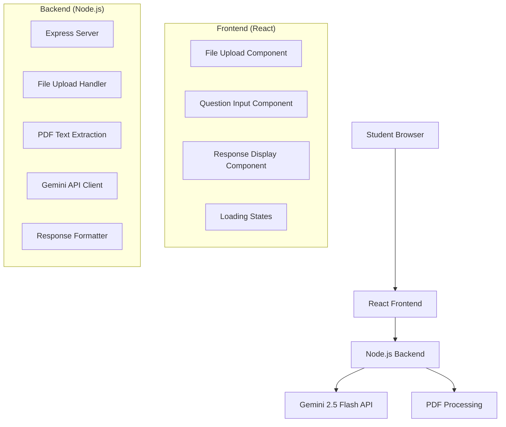

# Design Document

## Overview

The UNDEFINED educational AI application is designed as a simple, stateless web application that enables students to upload PDF course materials and ask questions about the content. The system consists of a React frontend for user interaction and a Node.js backend that processes requests using Google's Gemini 2.5 Flash API.

The architecture prioritizes simplicity and rapid prototyping, avoiding complex authentication, databases, or persistent storage to validate the core concept quickly.

## Architecture

### High-Level Architecture



### Technology Stack

**Frontend:**
- React 18+ with functional components and hooks
- Modern CSS or styled-components for styling
- Axios or fetch for HTTP requests
- File handling with HTML5 File API

**Backend:**
- Node.js with Express.js framework
- Multer for file upload handling
- PDF parsing library (pdf-parse or similar)
- Google Generative AI SDK for Gemini integration
- CORS middleware for cross-origin requests

## Components and Interfaces

### Frontend Components

#### 1. App Component
- Main application container
- Manages global state for uploaded file and conversation
- Handles error boundaries and loading states

#### 2. FileUpload Component
```typescript
interface FileUploadProps {
  onFileSelect: (file: File) => void;
  selectedFile: File | null;
  isUploading: boolean;
}
```
- Drag-and-drop file upload area
- File validation (PDF only, size limits)
- Visual feedback for upload status
- Clear file selection functionality

#### 3. QuestionInput Component
```typescript
interface QuestionInputProps {
  onSubmit: (question: string) => void;
  disabled: boolean;
  isLoading: boolean;
}
```
- Text area for natural language questions
- Submit button with loading states
- Character count and validation
- Disabled state when no file is uploaded

#### 4. ResponseDisplay Component
```typescript
interface ResponseDisplayProps {
  response: string | null;
  isLoading: boolean;
  error: string | null;
}
```
- Formatted display of AI responses
- Loading spinner during processing
- Error message display
- Markdown or rich text formatting support

### Backend API Endpoints

#### POST /api/ask
```typescript
interface AskRequest {
  question: string;
  file: File; // PDF file
}

interface AskResponse {
  response: string;
  success: boolean;
  error?: string;
}
```

**Request Processing Flow:**
1. Validate file type and size
2. Extract text from PDF
3. Construct prompt with context and question
4. Send to Gemini API
5. Format and return response

## Data Models

### File Processing
```typescript
interface ProcessedFile {
  originalName: string;
  mimeType: string;
  size: number;
  textContent: string;
  extractedAt: Date;
}
```

### Question Context
```typescript
interface QuestionContext {
  question: string;
  documentContent: string;
  timestamp: Date;
  language: 'pt' | 'en'; // Auto-detected or default
}
```

### API Response
```typescript
interface AIResponse {
  answer: string;
  confidence?: number;
  sources?: string[]; // Relevant sections from PDF
  processingTime: number;
}
```

## Error Handling

### Frontend Error Handling
- File validation errors (wrong type, too large)
- Network connectivity issues
- API timeout handling
- User-friendly error messages in Portuguese/English

### Backend Error Handling
- PDF parsing failures
- Gemini API rate limits and errors
- File size and type validation
- Graceful degradation for service unavailability

### Error Response Format
```typescript
interface ErrorResponse {
  success: false;
  error: {
    code: string;
    message: string;
    details?: any;
  };
}
```

## Testing Strategy

### Frontend Testing
- Unit tests for individual components using Jest and React Testing Library
- Integration tests for file upload and question submission flows
- Visual regression tests for UI consistency
- Accessibility testing with axe-core

### Backend Testing
- Unit tests for PDF processing and API integration
- Integration tests for complete request/response cycles
- Mock Gemini API responses for consistent testing
- Error handling and edge case validation

### End-to-End Testing
- File upload and question submission workflow
- Error scenarios (invalid files, network issues)
- Response formatting and display
- Cross-browser compatibility testing

## Security Considerations

### File Upload Security
- File type validation (PDF only)
- File size limits (e.g., 10MB max)
- Temporary file storage with automatic cleanup
- No persistent file storage to minimize data exposure

### API Security
- Input sanitization for questions
- Rate limiting to prevent abuse
- CORS configuration for allowed origins
- Environment variable management for API keys

### Data Privacy
- No user tracking or persistent data storage
- Temporary processing only
- Clear data handling policies
- GDPR compliance considerations for EU users

## Performance Considerations

### Frontend Optimization
- Lazy loading for components
- Debounced input handling
- Optimized bundle size
- Progressive loading states

### Backend Optimization
- Streaming file uploads
- Efficient PDF text extraction
- Connection pooling for API requests
- Response caching for identical questions (optional)

### Scalability Notes
- Stateless design enables horizontal scaling
- Consider CDN for static assets
- API rate limiting and queuing for high load
- Monitoring and logging for performance insights